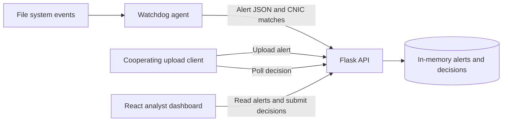

# Architecture

`backend/admin_server.py` owns alert ingestion, combined alert retrieval, preview rendering, and analyst decisions. `frontend/src/services/api.js` centralizes Axios requests; React pages use shared request hooks and error handling. `backend/upload_monitor_agent.py` observes user folders and submits file metadata and regex matches.

`simple_test_server.py` provides a separate local upload demonstration on port 8080. `network_monitor_agent.py` and `http_upload_blocker.py` contain experimental process-based monitoring; their names do not imply comprehensive interception. Windows service and deployment utilities are retained for exploration and are not exercised by CI.

## API workflow

| Method and path | Purpose |
| --- | --- |
| `POST /upload_alert` | Submit an upload for review; requires `X-API-KEY` |
| `POST /file_activity_alert` | Submit a file event; requires `X-API-KEY` |
| `GET /alerts` | Retrieve combined pending alerts; requires `X-API-KEY` |
| `POST /upload_decision` | Record `allow` or `block` for an alert |
| `GET /check_decision/<upload_id>` | Poll a cooperating client's decision; requires `X-API-KEY` |
| `GET /api/reports/summary` | Demonstration report values; requires `X-API-KEY` |

The two alert collections currently allocate IDs independently. A collision can make decision routing ambiguous because upload alerts are checked first. Tests cover the upload workflow independently; namespaced IDs are a documented follow-up.

## Configuration

All Python clients read `DATASHIELD_API_KEY` from the process environment. The API refuses to import without a nonempty key. Configure the same value in the agent process and `frontend/.env` as `REACT_APP_API_KEY`. The Flask host defaults to `127.0.0.1`; `DATASHIELD_HOST` overrides it for explicitly configured environments.

The React environment file is loaded by react-scripts. Python uses process environment variables, not automatic `.env` loading. Installed Windows services require configuration in their service environment. Run the deployment utility from `backend/` so its relative file-copy paths resolve.
