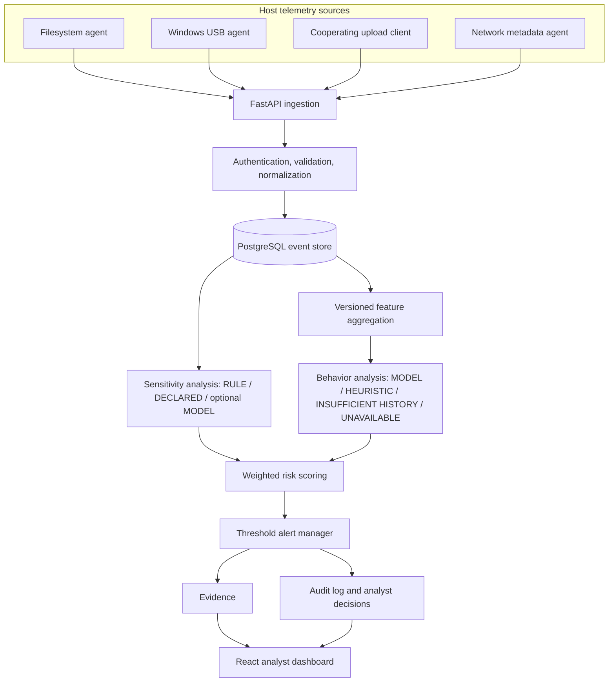

# Architecture

The FastAPI service is a modular monolith. SQLAlchemy models live in `backend/app/models.py`, validation in `schemas.py`, and analysis in `analysis.py`. Original Flask tables are retained by migration; the deployed stack starts only FastAPI and does not install Flask in the runtime image. `source_event_id` is unique for agent retries. Metadata is allowlisted; scanned text and raw matches are discarded.

The optional psutil network collector emits connection metadata only. It does not label a connection as an upload.

Risk is a weighted sum of 0–100 components. Default weights: anomaly .20, sensitivity .30, activity .20, channel .20, history .10. Default alert threshold: 55. These are prototype triage priorities, not calibrated probabilities. Feature schema is `event-window-v2`. The unusual extension count uses a fixed archive/database extension set (`.zip`, `.7z`, `.rar`, `.sql`, `.db`); it is a heuristic indicator, not a learned rarity measure. The UI polls every 15 seconds. Host agents run outside containers to access Windows events. File copy is observable as destination creation, without reliable source inference.
