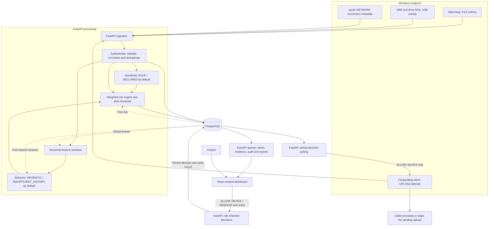

# Architecture

DataShield is a FastAPI modular monolith with a React analyst interface and PostgreSQL persistence. Host agents run outside Docker to access Windows events. The diagram shows the processing and response paths; UI reads and decisions go through the API.

`RESOLVE` closes an analyst workflow; it is not an upload enforcement response. Only `ALLOW` and `BLOCK` are returned as terminal analyst decisions to cooperating upload clients. Below-threshold uploads can receive policy auto-allow. A seeded upload event shows the decision contract; it does not prove that a real transfer was stopped.

## Processing and persistence

- `backend/app/main.py` owns ingestion, queries, and role-checked actions; `models.py` defines SQLAlchemy records and `schemas.py` validates requests.
- `analysis.py` defines sensitivity rules, feature aggregation, the behavior heuristic, and composite risk. `sensitivity.py` also supports an optional configured model adapter.
- PostgreSQL stores normalized events, feature windows, risk explanations, alerts, masked detections, analyst decisions, and audit records. Queries and reports use stored data.
- Agent retry requests reuse `source_event_id`; the API checks it and the database enforces uniqueness. This does not promise durable offline delivery or deduplication of independently generated IDs.
- Metadata is allowlisted and scanned text is discarded. Masking detection matches does not anonymize resource paths or other allowed metadata.

## Risk and analysis sources

Default risk weights are anomaly `0.20`, sensitivity `0.30`, activity `0.20`, channel `0.20`, and history `0.10`. Components are on a 0-100 scale; weighted contributions form the capped score. The default alert threshold is `55`; severity cutoffs are `35`, `65`, and `85`. These policy values are triage priorities, not calibrated probabilities.

The feature schema is `event-window-v2`; scoring is `weighted-v1`. The current history rule requires at least three earlier feature windows and scores count excess above their mean. No trained behavior model is active. Optional model loading reports `MODEL` only for an accepted configured artifact, or `UNAVAILABLE` if the configured behavior artifact fails. Sensitivity supports `RULE`, `DECLARED`, `UNAVAILABLE`, and an optional `MODEL` adapter; the demo uses rules. See the [technical fact sheet](../fyp/technical-facts.md).

## Endpoint and response boundaries

The network collector observes browser connection metadata, not HTTPS payloads. File copy is observed as destination creation without reliable source inference. Removable-drive activity uses WMI volume notifications, Watchdog, and the Windows drive-type API. No physical USB validation is claimed by this diagram.

The dashboard polls for updates every 15 seconds. Recording a decision cannot reverse a completed file operation. Cooperating upload callers must honor the approval result before transferring.

Original Flask tables and their migration/import support remain under `legacy/flask/`; Compose starts FastAPI. See [database](database.md), [security](../security/security.md), and [synthetic demo](../fyp/fyp-demo-runbook.md).
